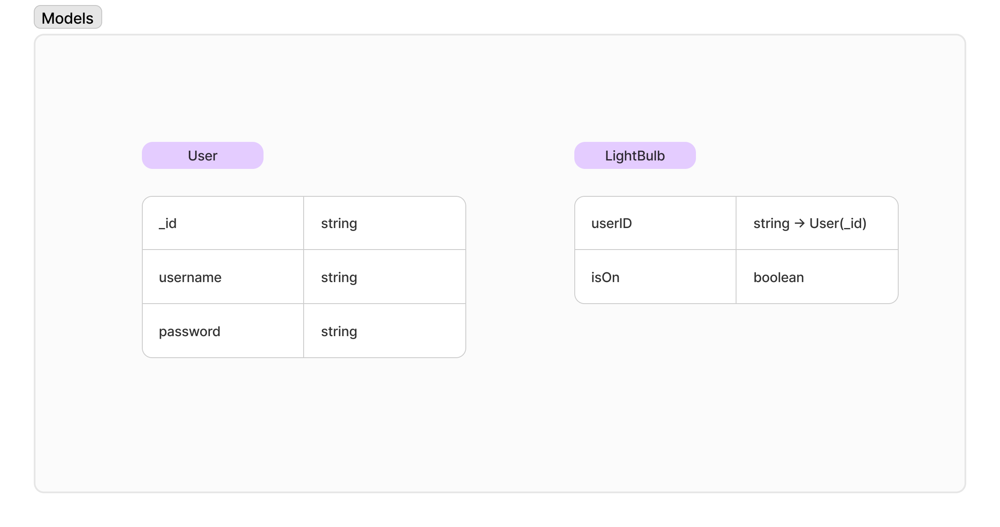

# Growth App Interview Project: Lit

**Technologies**: NextJS & MongoDB
**Libraries**: OpenAI, NextAuth

# Features
Create full-stack chat app that allows the user toggle a virtual light bulb from a chat prompt.

**Requirements**
- LightBulb Component Showing On & Off State (✅️)
- GPT 4o-mini (function calling)  to get the light status and toggle the light status

**Bonus Points**

- Add a simple username and password login page. (✅️)
- Add End - End testing with Cypress 〰️

---

### Model Structure

